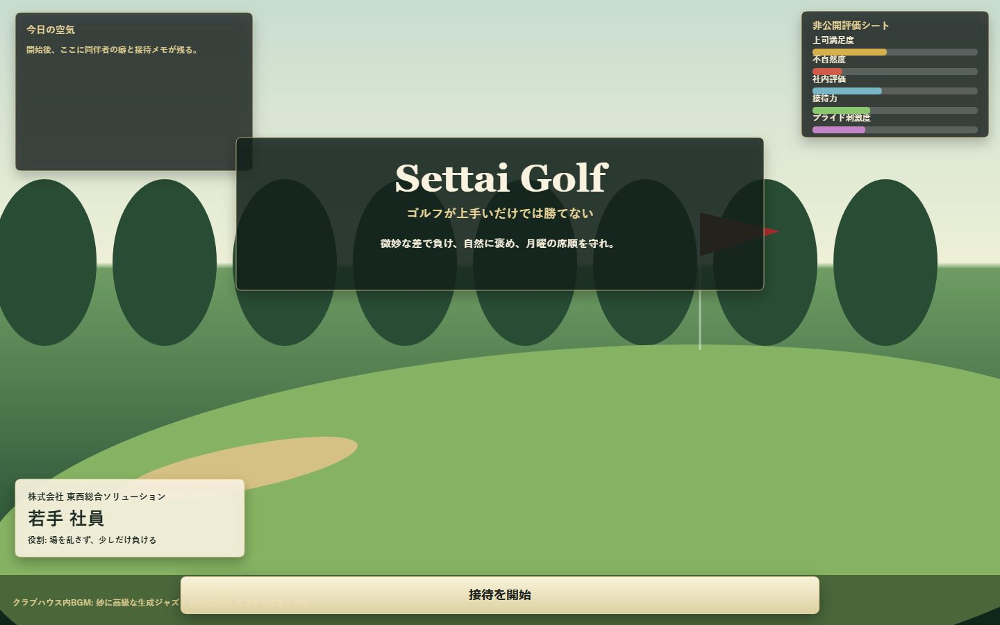
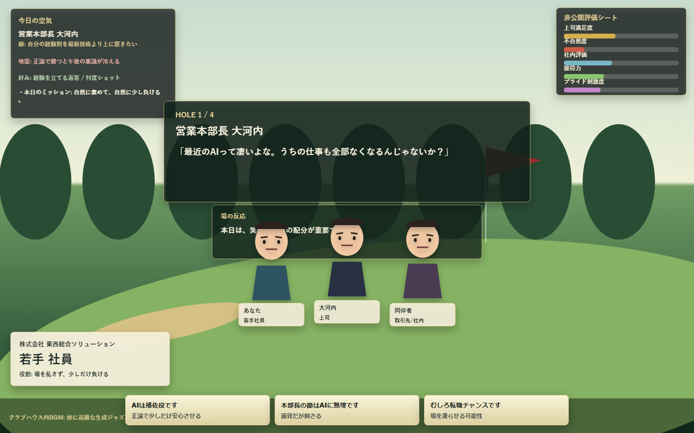
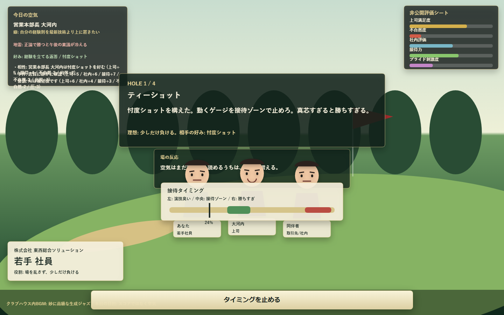
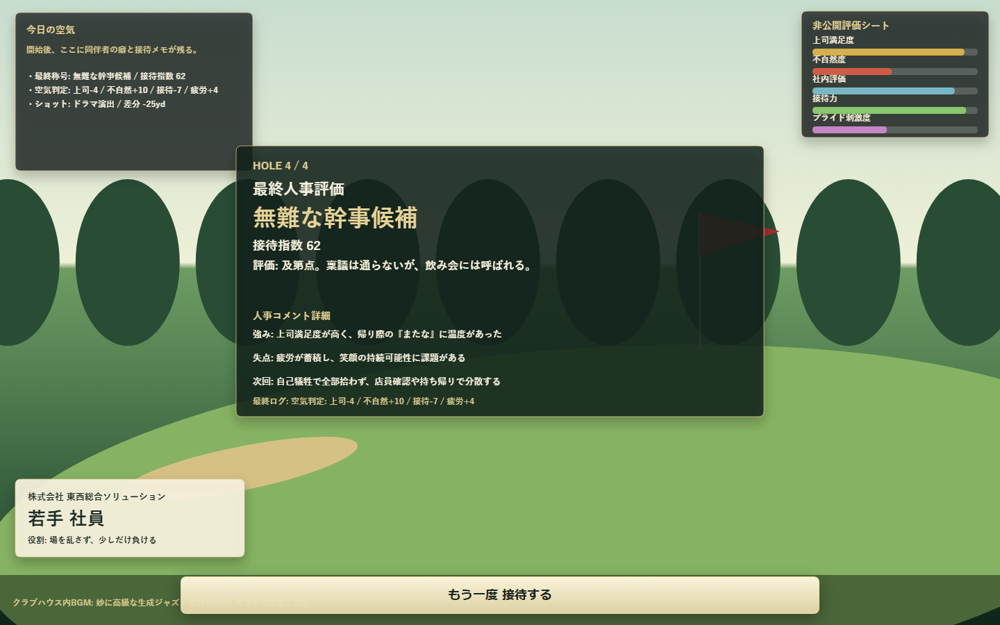

# Settai Golf

「ゴルフが上手いだけでは勝てない」日本社会シミュレーターです。

Play: https://jim-auto.github.io/settai-golf/

プレイヤーは日本企業の若手社員として、上司、取引先、社内政治を読みながら、完璧な接待ゴルフを成立させます。重要なのはスコアではなく、空気、忖度、会話、微妙な負け方です。

## 遊び方

1. タイトル画面で「接待を開始」を押します。
2. 1ホールごとに会話イベントが発生します。
3. 空気を読みながら返答を選びます。
4. ショット方針を選びます。
5. 動くタイミングゲージを止めます。
6. 上司より少しだけ悪い結果を目指します。
7. 4ホール終了後、接待指数と最終称号が出ます。

勝ちすぎると嫌われます。わざとミスしすぎてもバレます。理想は、自然に見える小さな敗北です。

## 現在入っている要素

- 会話イベント
- 突発の事件カード
- 相手ごとの好み
- タイミング式ショットミニゲーム
- キャラ表情と場の反応
- 隠し評価ゲージ
- 接待メモ
- 最終称号
- リザルト詳細コメント

## コンセプト

Settai Golf は本格ゴルフゲームではありません。

平成から令和の日本企業、高級ゴルフ場、PowerPoint感、名刺文化、微妙な圧を混ぜた、軽量な接待シミュレーターです。

## スクリーンショット

### タイトル



### 会話イベント



### ショットミニゲーム



### 最終評価



## 開発方法

```bash
npm install
npm run dev
```

スクリーンショット更新:

```bash
npm run screenshots
```

ビルド確認:

```bash
npm run build
npm run preview
```

## GitHub Pages

Vite の `base` は `/settai-golf/` に設定済みです。

`gh-pages` ブランチへビルド成果物をデプロイします。リポジトリ設定の Pages で Source を `Deploy from a branch`、Branch を `gh-pages`、Folder を `/ (root)` にしてください。

公開URL:

```text
https://jim-auto.github.io/settai-golf/
```

デプロイ:

```bash
npm run deploy
```

## 技術構成

- Vite
- TypeScript
- HTML5 Canvas
- Web Audio API
- GitHub Pages 対応

## Repository

https://github.com/jim-auto/settai-golf
